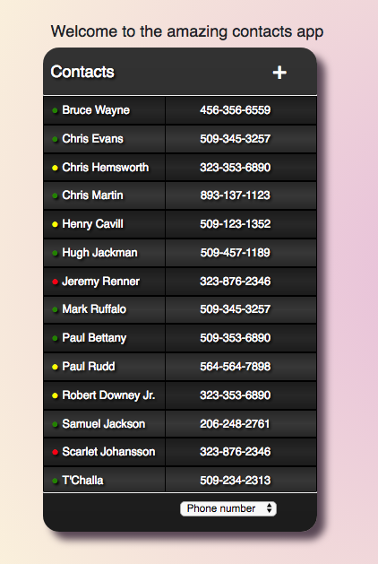

# assignment01

> A Vue.js project

## Build Setup

``` bash
# install dependencies
npm install

# serve with hot reload at localhost:3000
npm run dev

# build for production with minification
npm run build

# build for production and view the bundle analyzer report
npm run build --report

# run unit tests
npm run unit

# run e2e tests
npm run e2e

# run all tests
npm test

# build 2dkit games
npm run build-games
```

For detailed explanation on how things work, checkout the [guide](http://vuejs-templates.github.io/webpack/) and [docs for vue-loader](http://vuejs.github.io/vue-loader).
=======
# README #

### What is this repository for? ###

* This is a contact application 
* Made as a first assignment at 14Four
* Objectives Learned: States, components, passing and taking parameters, better css, debugging, much more... 


